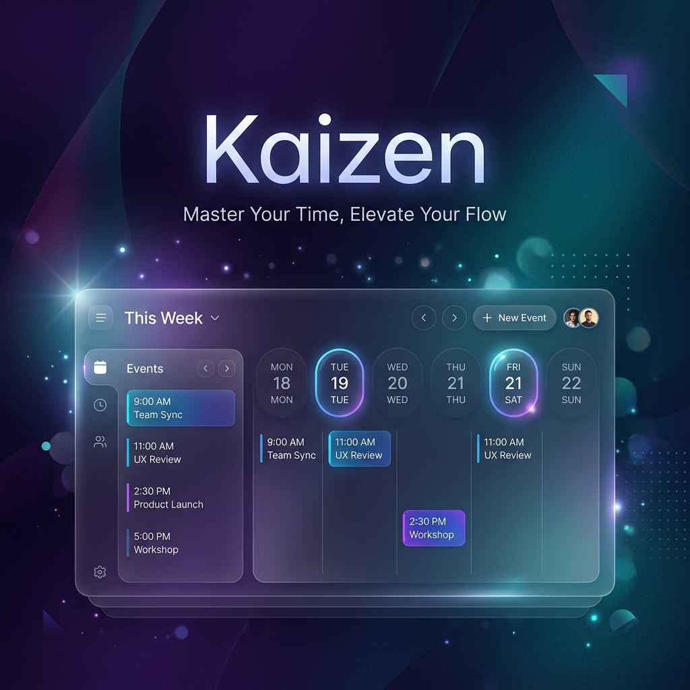

# 🎌 Kaizen: The Immersive Calendar



A high-performance, aesthetically-driven calendar application designed for focus and productivity. Built with **React** and **Vite**, Kaizen blends modern design with advanced features like AI-powered task decomposition and Supabase synchronization.

## ✨ Features

- **🌈 15+ Immersive Themes** – From *Tokyo Night* to *Retrowave*, personalize your focus space with meticulously crafted themes that transform the entire UI mood.
- **🤖 Smart Decompose** – Leverage the power of AI (Gemini 2.0 Flash) via OpenRouter to break down complex goals into 10 actionable sub-tasks instantly.
- **🔄 Supabase Sync** – Real-time synchronization of your tasks and preferences across devices with secure authentication and offline-first support.
- **📱 PWA Ready** – Installable on mobile and desktop with offline capabilities, ensuring your schedule is always accessible.
- **📅 Dynamic Views** – Seamlessly switch between Day, Week, Month, and Year views with fluid, hardware-accelerated transitions.
- **🖱️ Intuitive Navigation** – Drag, swipe, and scroll through time with a responsive interface optimized for both touch and mouse.
- **🇮🇳 Localization** – Built-in support for Indian holidays and locale-specific date formatting.

## 🚀 Tech Stack

- **Frontend:** React 18, Vite
- **Styling:** Vanilla CSS (Custom Variable-based Design System)
- **Database & Auth:** Supabase
- **AI Core:** OpenRouter API (Gemini 2.0 Flash)
- **PWA:** Vite-PWA
- **Asset Optimization:** Sharp

## 🛠️ Getting Started

### Prerequisites

- Node.js (v18 or higher)
- A Supabase project (URL and Anon Key)
- An OpenRouter API Key (for AI features)

### Installation

1. **Clone the repository:**
   ```bash
   git clone https://github.com/sujayghosh13/Kaizen.git
   cd kaizen
   ```

2. **Install dependencies:**
   ```bash
   npm install
   ```

3. **Environment Setup:**
   Create a `.env` file in the root directory:
   ```env
   # OpenRouter (Required for Smart Decompose)
   VITE_OPENROUTER_API_KEY=your_api_key_here

   # Supabase (Optional: already pre-configured in src/supabaseClient.js)
   # VITE_SUPABASE_URL=your_url
   # VITE_SUPABASE_ANON_KEY=your_key
   ```

4. **Launch Application:**
   ```bash
   npm run dev
   ```

The app will be available at **http://localhost:5173** (default Vite port).

## 🎨 Design Philosophy

Kaizen is built on the principle of **Immersive Productivity**. We believe that your workspace should inspire you. Our custom CSS theme engine allows for deep visual customization without sacrificing performance, using native CSS variables for real-time theme switching.

---

Built with ❤️ by [Sujay Ghosh](https://github.com/sujayghosh13)
